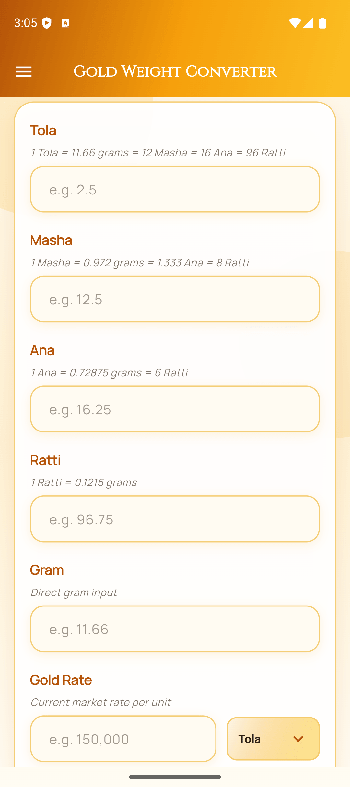
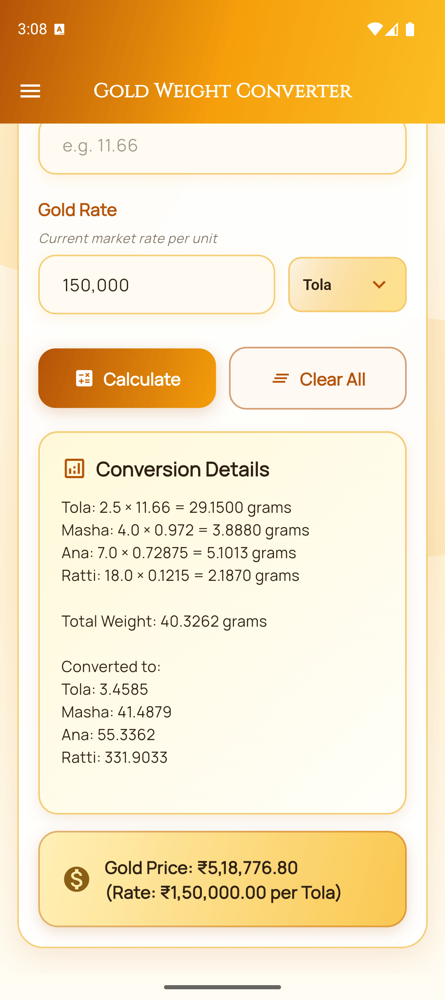
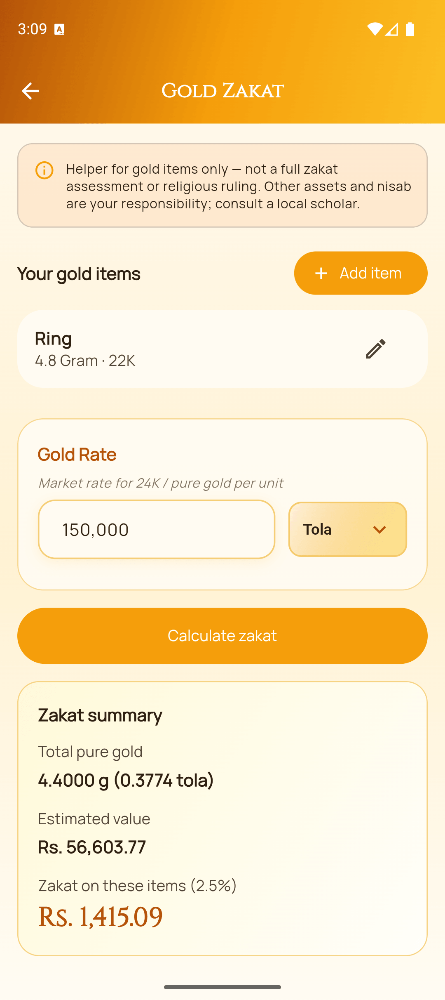
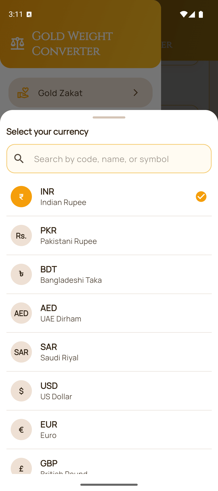
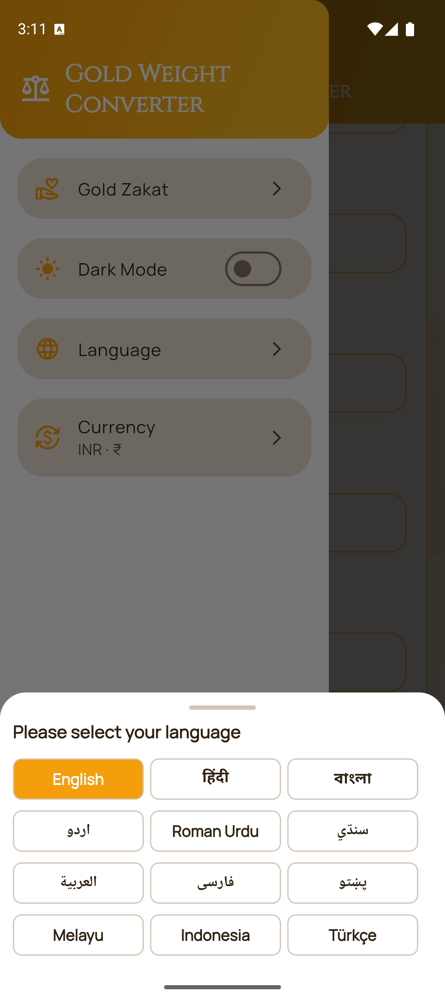
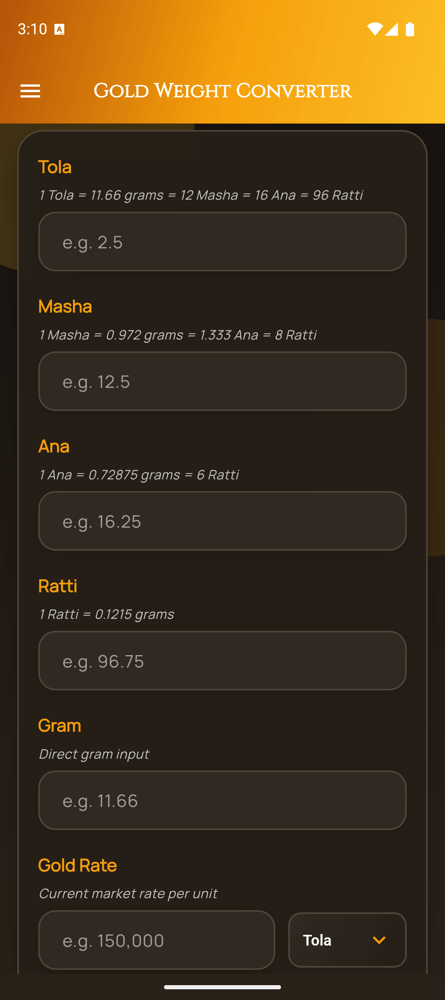
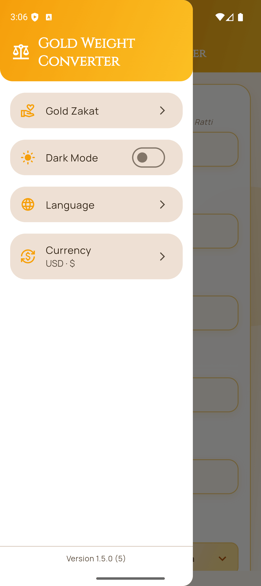

# Gold Weight Converter App

A clean, open-source Flutter app to convert gold weight between traditional South Asian units (Tola, Masha, Ana, Ratti) and metric units (Gram), with gold price estimation, display-currency formatting, and a gold zakat calculator.

**[Try the live demo](https://dr-usman.github.io/Gold-Weight-Converter/)**

## Features

- Convert weights between Tola, Masha, Ana, Ratti, and Gram
- Calculate gold price by rate per Tola, per 10 Gram, or per 1 Gram
- Gold zakat calculator (drawer → Gold Zakat)
  - Add items with weight, unit, and purity (24K / 22K / 21K / 18K / custom karat)
  - Shared 24K market rate; applies 2.5% on listed items (no nisab gate)
  - Pure-gold grams, estimated value, and zakat due summary
  - Items and rate persisted across sessions
- Searchable display currency preference in the drawer (locale-aware default; formatting only, no FX conversion)
- Show conversion and pricing breakdown with readable formulas
- Persisted theme support: light, dark, and system mode
- Multilingual UI with in-app language switching (12 supported locales)
- Smart numeric input formatting with thousands separators
- Clear-all reset for all fields and computed results
- Accessibility labels for key input fields

## Screenshots

| Converter | Results & price |
| --- | --- |
|  |  |
| **Gold zakat** | **Currency** |
|  |  |
| **Languages** | **Dark mode** |
|  |  |
| **Menu & settings** | |
|  | |

## Download

- Please choose one Android source (GitHub Releases or Play Store). Switching sources may require uninstall/reinstall because signing certificates differ.

<a href="https://github.com/Dr-Usman/Gold-Weight-Converter/releases/latest">
  
</a>
<a href="https://play.google.com/store/apps/details?id=com.avenzor.gold_weight_converter">
  
</a>

## Conversion Table

| Unit    | Gram Equivalent | Notes                            |
| ------- | --------------- | -------------------------------- |
| 1 Tola  | 11.66 g         | = 12 Masha = 16 Ana = 96 Ratti  |
| 1 Masha | 0.972 g         | = 1.333 Ana = 8 Ratti           |
| 1 Ana   | 0.72875 g       | = 6 Ratti                       |
| 1 Ratti | 0.1215 g        |                                  |

These are standard traditional conversion factors used in the app calculations.

## Supported Languages

The app supports 12 locales:

- English (en)
- Urdu (ur)
- Roman Urdu (ur-RO)
- Arabic (ar)
- Bengali (bn)
- Farsi/Persian (fa)
- Hindi (hi)
- Indonesian (id)
- Malay (ms)
- Pashto (ps)
- Sindhi (sd)
- Turkish (tr)

Language can be changed from the settings drawer and is persisted across sessions.

## Supported Platforms

- Android
- iOS
- Web
- macOS
- Linux
- Windows

Android is the primary distributed platform (Play Store + GitHub release APKs).

## Getting Started

### Prerequisites

- Flutter SDK (latest stable): https://flutter.dev/docs/get-started/install
- Dart SDK compatible with this project: ^3.11.5 (bundled with Flutter)
- Android Studio or VS Code
- A connected device or emulator

### Installation

1. Clone the repository:

```bash
git clone https://github.com/Dr-Usman/Gold-Weight-Converter.git
cd Gold-Weight-Converter
```

2. Install dependencies:

```bash
flutter pub get
```

3. Run the app:

```bash
flutter run
```

## Developer Workflow

### Quality checks

```bash
dart format --output=none --set-exit-if-changed .
flutter analyze
flutter test
```

### Useful test commands

```bash
flutter test test/widget_test.dart
flutter test test/zakat_calculator_test.dart
flutter test test/widget_test.dart --plain-name 'calculates gold price using the tola rate unit'
```

### Build commands

```bash
flutter build apk --debug
flutter build apk --release
flutter build apk --split-per-abi
flutter build appbundle
flutter build web --release --base-href "/Gold-Weight-Converter/"
```

## Architecture At A Glance

- App bootstrap in `lib/main.dart` initializes PreferencesService and injects it via Riverpod `ProviderScope` override; `lib/app.dart` hosts `MaterialApp`.
- Screens live in `lib/screens/` (`converter_screen.dart`, `zakat_screen.dart`).
- Shared conversion and zakat math live in `lib/services/` (`weight_converter.dart`, `zakat_calculator.dart`).
- State is managed by Riverpod providers in `lib/providers/` for theme, locale, currency, converter results, zakat items, rate unit, and app version.
- Shared preference persistence is centralized in `lib/services/preferences_service.dart`.
- Reusable UI components are in `lib/widgets/` (input field, drawer, language/currency sheets, gold item sheet).
- Localization is generated from ARB files in `lib/l10n/`.

## Releases

- Version is maintained in pubspec.yaml (current: 1.5.0+5).
- Change history is tracked in CHANGELOG.md.
- For each release, add developer notes under `## [X.Y.Z]` plus a short **user-facing** `### Play Store (en-US)` section (paste into Google Play Console). Keep Play Store copy plain-language; no separate what’s-new file.
- Tagging `v*` creates a GitHub Release titled **GWC vX.Y.Z**. Release body is generated from that CHANGELOG section (Play Store subsection excluded) with a Full Changelog link at the bottom.
- Per-platform workflows attach versioned assets:
  - Android: `gwc-android-X.Y.Z-universal.apk` + ABI splits
  - Web: `gwc-web-X.Y.Z.zip`
  - macOS: `gwc-macos-X.Y.Z.zip`
  - Linux: `gwc-linux-X.Y.Z-x64.tar.gz`
  - Windows: `gwc-windows-X.Y.Z-x64.zip`
  - iOS: manual `workflow_dispatch` only (signing secrets required)
- The same `v*` tags also deploy the web build to GitHub Pages (`.github/workflows/deploy-pages.yml`), live at https://dr-usman.github.io/Gold-Weight-Converter/.

Example release flow:

```bash
# 1. Bump pubspec.yaml version (e.g. 1.5.0+5)
# 2. Update CHANGELOG.md (developer notes + ### Play Store section)
git add pubspec.yaml CHANGELOG.md README.md
git commit -m "release: vX.Y.Z+N"
git tag vX.Y.Z
git push origin main --tags
```

Then paste the Play Store section from CHANGELOG.md into Google Play Console → Release → Release notes.

## Contributing

Please read CONTRIBUTING.md for contribution workflow, checks, and pull request guidance.

## License

This project is licensed under the MIT License. See LICENSE for details.
