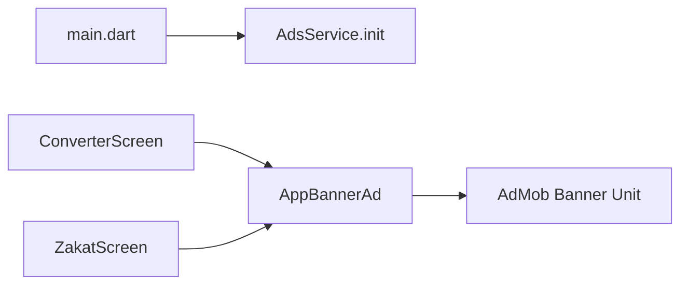

# Ads inventory and revenue roadmap

> Saved for later. Status: planning only — not implemented yet.
> Original Cursor plan: Ads revenue strategy (2026-03-30)

## Overview

Inventory of the app’s current AdMob setup (adaptive banners only), a clear answer on banner refresh policy, and a phased monetization roadmap that adds revenue without flooding users with ads.

## Todos

- [ ] **Phase 0** — Optimize existing AdMob banners (separate units, console refresh ≥60s, baseline metrics) — no code refresh timer
- [ ] **Phase 1** — Add frequency-capped interstitial only on Zakat navigation transition (not on Calculate)
- [ ] **Phase 2** — Optional rewarded: watch ad → remove banners for 24h
- [ ] **Phase 3** — Optional cold-start app-open with strict caps after Phase 1 metrics look healthy

---

## What is implemented today

Only **Google AdMob** via `google_mobile_ads` (^9.0.0). No other networks, mediation, interstitials, rewarded, app-open, or native ads.

| Format | Status | Where |
|---|---|---|
| Inline adaptive banner | Live | Converter + Zakat scroll content |
| Interstitial | Not implemented | — |
| Rewarded | Not implemented | — |
| App open | Not implemented | — |
| Native | Not implemented | — |

Key files:
- [`lib/constants/ad_config.dart`](../lib/constants/ad_config.dart) — App ID, prod/test banner unit, `HIDE_ADS`
- [`lib/services/ads_service.dart`](../lib/services/ads_service.dart) — SDK init at startup
- [`lib/widgets/app_banner_ad.dart`](../lib/widgets/app_banner_ad.dart) — loads once per widget mount; hides on failure
- Placed in [`converter_screen.dart`](../lib/screens/converter/converter_screen.dart) (~line 631) and [`zakat_screen.dart`](../lib/screens/zakat/zakat_screen.dart) (~line 317)

Current banner behavior is already conservative: load once, no timer refresh, no sticky overlay, Android/iOS only.

---

## Manual / forced banner refresh — policy answer

**Do not manually refresh banners on Calculate taps, screen rebuilds, or a short timer (&lt; 60s).**

Google’s guidance ([Implementation guidance](https://support.google.com/admob/answer/2936217)):
- Ads should persist **60 seconds or longer**
- Refreshing more often **hurts fill rate** and can look like invalid traffic
- If users navigate away and back quickly, do **not** request a new ad sooner than ~60s

What is OK:
- Let AdMob’s **console auto-refresh** handle it (set ≥ 60s in AdMob UI), **or** keep your current “load once until dispose” approach (also fine)
- Reload only after dispose + remount **and** ≥ 60s since last request

What to avoid:
- `Timer.periodic` refreshing every 15–30s
- Reloading banner on every `calculateAll()` / `_calculateZakat()`
- Reloading on theme/language rebuilds within 60s

So: manual fast refresh is not a smart revenue play and risks policy / invalid-traffic issues. Prefer **new formats at natural breaks** over refreshing the same banner harder.

---

## Where *not* to add ads (protect retention)

- On every Calculate tap (utility core loop — high churn risk)
- Next to primary buttons (accidental clicks → invalid traffic)
- Multiple banners on one screen
- Interstitial when opening the drawer, changing language/theme, or copying results
- App-open on every resume (feels spammy for a calculator)

---

## Recommended step-by-step approach

### Phase 0 — Optimize what you already have (no new ads, low risk)

Goal: more revenue from the same two banners without more UX friction.

1. In AdMob console: confirm banner unit auto-refresh ≥ 60s (or leave SDK-load-once as-is)
2. Create **separate ad units** for Converter vs Zakat (better reporting; optional mediation later)
3. Watch eCPM / match rate / CTR for 1–2 weeks before adding formats
4. Keep banners **below results** (current placement is good — after value is shown)

### Phase 1 — One soft interstitial at a natural transition (highest safe lift)

Best single placement for this app:

- **When:** User opens **Zakat** from the drawer (screen transition), **or** returns from Zakat → Converter
- **Frequency cap:** max **1 interstitial / 3–5 minutes**, and never on first launch of the session
- **Never:** on Calculate, Copy, Share, language/theme/currency changes

Why this fits Google’s interstitial guidance: clear start/stop between activities, not during active calculation.

Implementation sketch: extend [`AdsService`](../lib/services/ads_service.dart) with `InterstitialAd` preload + `canShowInterstitial` (timestamp + session flags); trigger from drawer navigation to Zakat only.

### Phase 2 — Optional rewarded (best UX / revenue balance)

Users **choose** to watch → less hate, often higher eCPM.

Ideas that fit this app:
- “Watch ad → remove banners for 24 hours”
- “Watch ad → unlock a small extra” (e.g. keep last N calculations, export nicer share text) — only if you add real value

Do **not** pay users to click ads (policy violation). Rewarded = watch video for in-app benefit only.

### Phase 3 — App open (strictly capped)

- Cold start only, after splash/init, **not** every background→foreground
- Cap: once per cold start, or max once per several hours
- Skip if an interstitial was just shown

### Phase 4 — Monetization polish (after formats exist)

- AdMob mediation (Meta / AppLovin / Unity) for higher fill/eCPM
- Remote kill switch (or keep `HIDE_ADS`) for incidents
- If you expand to EU/CA: add UMP consent before any ad request (currently none; AGENTS.md notes no EU/CA at Quick Start)
- Track Mixpanel events for ad funnel (`interstitial_shown`, `rewarded_completed`) only after formats ship — follow [`AGENTS.md`](../AGENTS.md) conventions

---

## Suggested priority order (revenue vs user risk)

| Priority | Change | Revenue impact | User risk |
|---|---|---|---|
| 1 | Optimize existing banners + reporting | Low–medium | None |
| 2 | Frequency-capped interstitial on Zakat open | Medium–high | Low if capped |
| 3 | Rewarded “ad-free for a day” | Medium + goodwill | Very low |
| 4 | Capped app-open | Medium | Medium if overused |
| Avoid | Fast banner refresh / ads on Calculate | Short-term $ | High churn + policy |

---

## Concrete default recommendation

Ship **Phase 0 + Phase 1 only** first:
1. Keep current banners as-is (no manual refresh)
2. Add **one** interstitial when navigating to Zakat, with a **3–5 min** cooldown and skip-first-session-open
3. Measure retention + sessions for 2 weeks before adding rewarded or app-open

This increases impressions without stacking ads on the calculator loop users care about most.
